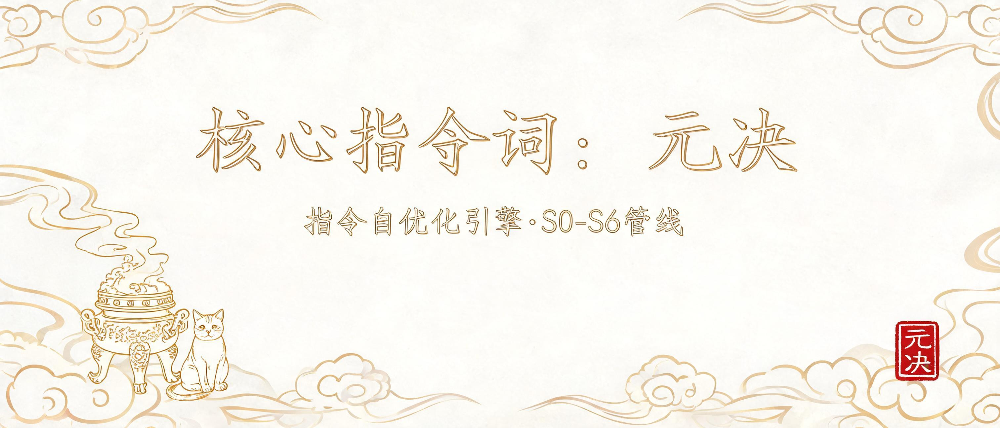

# 元决 · 指令自优化引擎 — S0-S6管线: 内容分析→问心→搜集→化神分析→输出优化→自升级

> Miao Agent 核心指令词 · v2.0 | 浅色国潮磨砂品牌视觉



## 是什么

指令自优化引擎 — S0-S6管线: 内容分析→问心→搜集→化神分析→输出优化→自升级

## 用法

```
元决 {目标/指令}
```

## 触发词

元决:{指令} / 自优化

## 原创声明

本项目为原创沉淀(本库自研方法论), 无外部开源借鉴。


## 说明

- 完整指令词本体: [SKILL.md](SKILL.md)
- 本图为示意横幅(出图优化迭代中)
